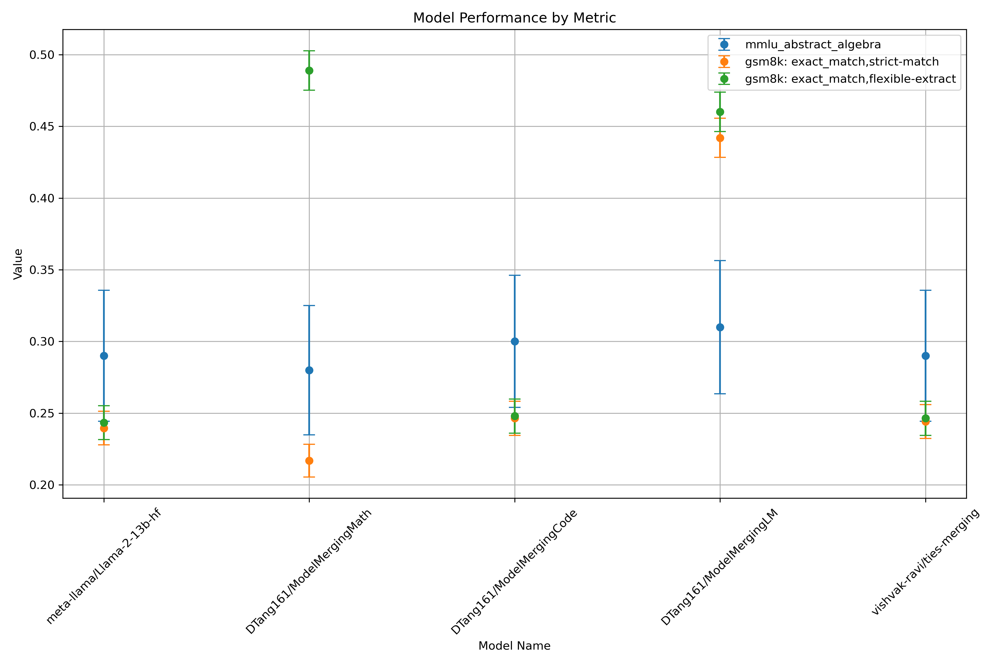

# TIES-Merging Implementation
An implementation of TIES-Merging, a model merging method, applied on Llama 2 and the finetuned models including WizardLM, WizardMath, and Code Alpaca.
## Implementation Details + Notes
Included is a Python notebook with a simple bare-bones implementation of TIES-Merging for CPU. Watch the RAM usage and delete intermediary tensors if needed. I ended up saving and loading at each step, decomposing functions to one-liners at some point. I also realized after merging, the merged weights are stored as double precision.
## Results
In addition to the merged model, all of the original models were evaluated in GSM8K and MMLU via ```lm-eval-harness```. I'm pretty unimpressed with the merged model, but I intend to revisit at some point to investigate further. I can't imagine the double precision weights causing this (maybe for CNN, but not transformer), but if anyone has ideas—reach out!

## References
[TIES-Merging](https://github.com/prateeky2806/ties-merging)  
[Language Model Evaluation harness](https://github.com/EleutherAI/lm-evaluation-harness)  
[WizardMath](https://wizardlm.github.io/WizardMath/)  
[WizardLM](https://github.com/nlpxucan/WizardLM)  
[Code Alpaca](https://github.com/sahil280114/codealpaca)